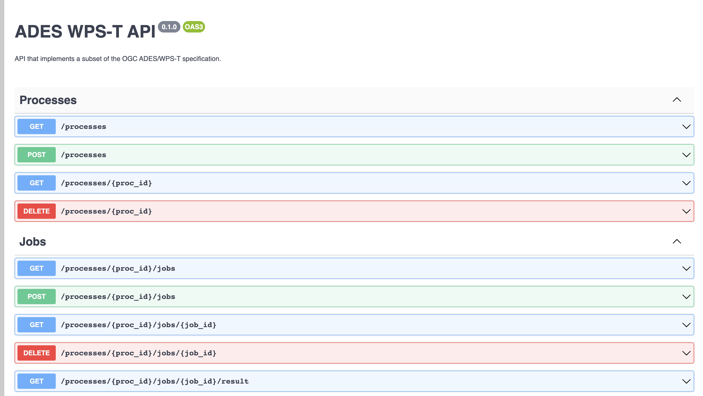

<!-- Header block for project -->
<hr>

<div align="center">


<h1 align="center">ades_wpst</h1>

</div>

<pre align="center">Stub flask app that implements a subset of the OGC ADES/WPST specification.</pre>

[](code_of_conduct.md) [](https://nasa-ammos.github.io/slim/)

This is an implementation of the OGC ADES/WPS-T specification: http://docs.opengeospatial.org/per/18-050r1.html#_wps_t_restjson

## Features

* Implements a subset of the OGC ADES/WPST specification.
* Can be run natively or inside a Docker container.
* Supports Flask as the underlying web framework.
* Provides example requests and sample responses for each WPS-T operation in the `examples` directory.
* Allows exploration of available endpoints via Swagger UI.
* Can be tested using Postman as a client.

## Contents

* [Quick Start](#quick-start)
* [Changelog](#changelog)
* [FAQ](#frequently-asked-questions-faq)
* [Contributing Guide](#contributing)
* [License](#license)
* [Support](#support)

## Quick Start

This guide provides a quick way to get started with our project. Please see our [docs](#) for a more comprehensive overview.

### Requirements

* Python
* Flask python module
* Docker (for containerized deployment)

### Setup Instructions

1. Clone the repo: `git clone https://github.com/unity-sds/ades_wpst.git`
2. Navigate to the repo directory: `cd ades_wpst`
3. Create a subdirectory for the SQLite database file: `mkdir sqlite`

Install natively as a python module with:
```
python setup.py install
```

The `Flask` python module is required for installation.

### Build Instructions

If you want to build the Docker container locally, follow these steps:
1. Be sure to follow the setup instructions first.
2. Build your own local container:
   - ```docker build -t unity/ades-wpst-api:<tag> -f docker/Dockerfile .```
4. For active development (not releases) and frequent builds, use the following to version containers by datetime:
5. ```export DOCKER_TAG=$(date +"%d-%m-%yT%H.%M.%S")```
   - ```docker build -t unity/ades-wpst-api:$DOCKER_TAG -f docker/Dockerfile .```
6. ```docker run -it -p 8000:5000 -v ${PWD}/sqlite:/flask_ades_wpst/sqlite -e "ADES_PLATFORM=HYSDS" unity/ades-wpst-api:$DOCKER_TAG```

### Test Instructions

N/A

### Run Instructions

Be sure to follow the setup instructions first.

Run the Flask app server with:
   ```python -m flask_ades_wpst.flask_wpst```

### Usage Examples

#### Run it as a Docker container

Be sure to follow the steps in the "Get started" section above first.
To run as a Docker container, but sure to do the following in the `docker run`
command as shown in the example below:

1. Map the Flask application server port to the host port (`-p` option)
1. Mount your `sqlite` subdirectory on the host machine in to the container
(`-v` option)
1. Set the `ADES_PLATFORM` environment variable to a supported environment
(e.g., `K8s`, `PBS`, `Generic`) (`-e` option).  If no environment variable
is set, the default is `Generic`, which results in no additional actions
being done on the host.

#### Run with Docker: 
For prototype, don't specify the platform when running the docker container

    docker run -it -p 8000:5000 -v ${PWD}/sqlite:/ades_wpst/sqlite unity/ades-wpst-api:<tag>


In the following, set the `ADES_PLATFORM` environment variable to the
appropriate setting for your platform (examples: K8s, PBS)

    docker run -it -p 8000:5000 -v ${PWD}/sqlite:/ades_wpst/sqlite -e "ADES_PLATFORM=<platform>" unity/ades-wpst-api:<tag>

#### Try out the OGC ADES/WPS-T endpoints
You can see the available endpoints by starting with the root endpoint and inspecting the links returned:

    curl http://127.0.0.1:5000/
    
#### Using Swagger UI
http://127.0.0.1:5000/api/docs#/


You can find the example requests and sample responses for each WPS-T operation in the `examples` directory. 

#### Run on Postman
To try out the WPS-T operations using Postman as a client,

You can import the collection under `examples/postman_collection` into the tool and run the requests.
 
Or you can download the collection: https://www.getpostman.com/collections/0686347f4f69157f07e3

To download Postman: postman.com/downloads/

## Changelog

See our [CHANGELOG.md](CHANGELOG.md) for a history of our changes.

See our [releases page](https://github.com/unity-sds/ades_wpst/releases) for our key versioned releases.

## Frequently Asked Questions (FAQ)

No questions yet. Propose a question to be added here by reaching out to our contributors! See support section below.

## Contributing

Interested in contributing to our project? Please see our: [CONTRIBUTING.md](CONTRIBUTING.md)

## License

See our: [LICENSE](LICENSE)

## Support

Contact [NamrataM](https://github.com/NamrataM) for support.
